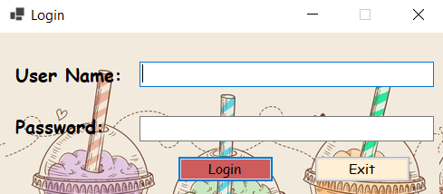
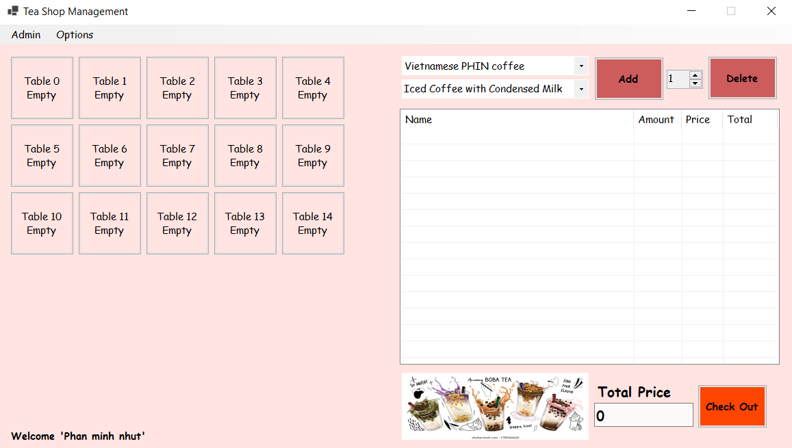
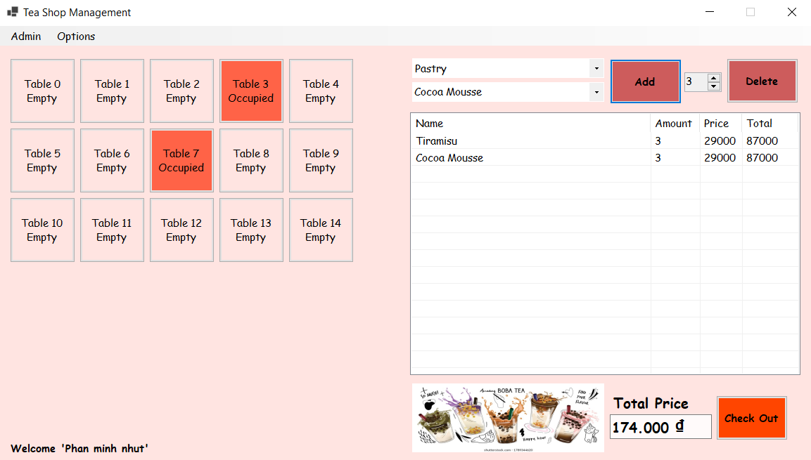
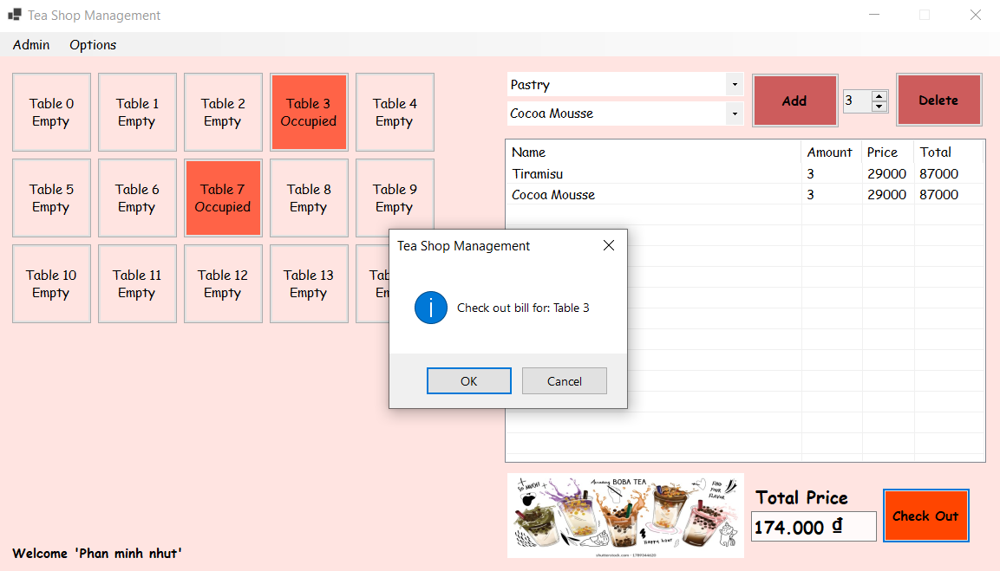
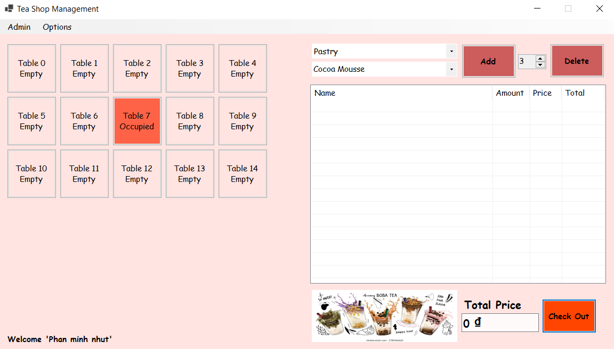
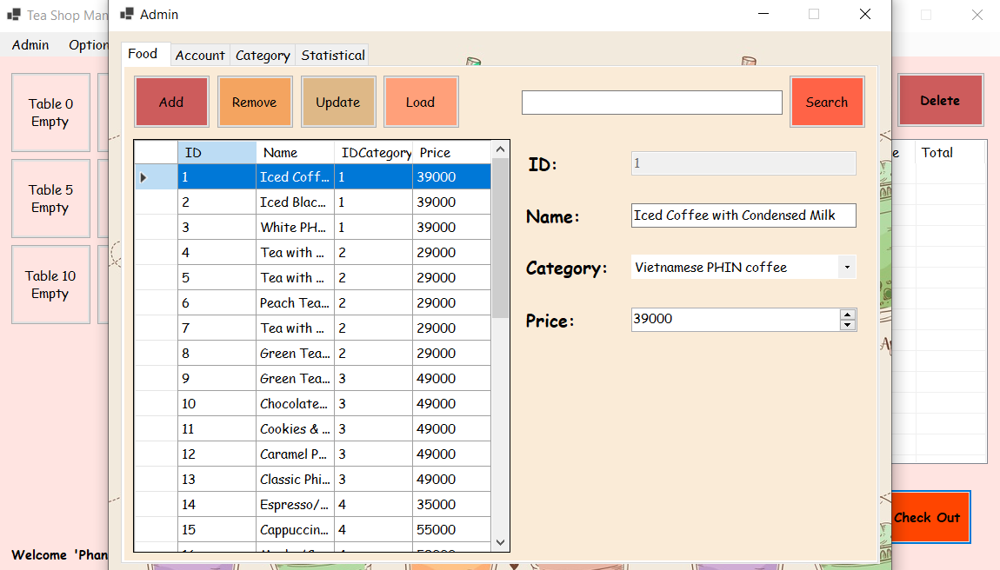
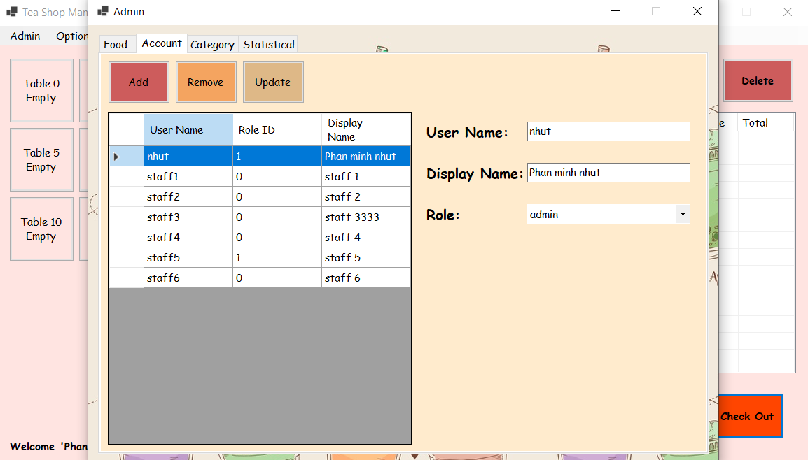
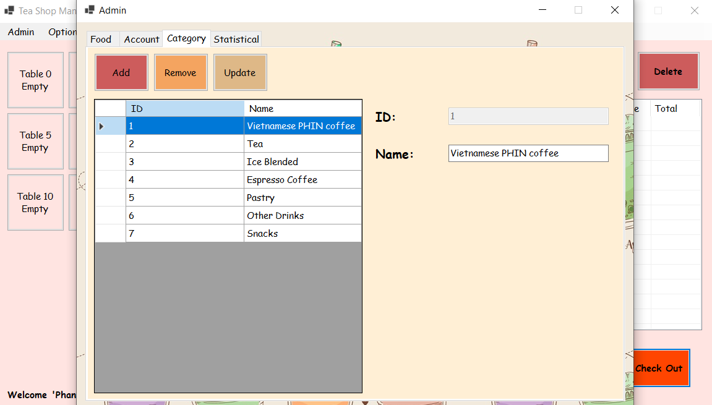
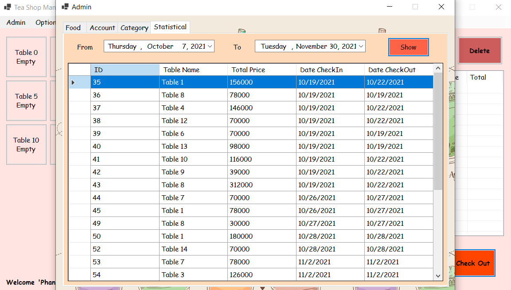
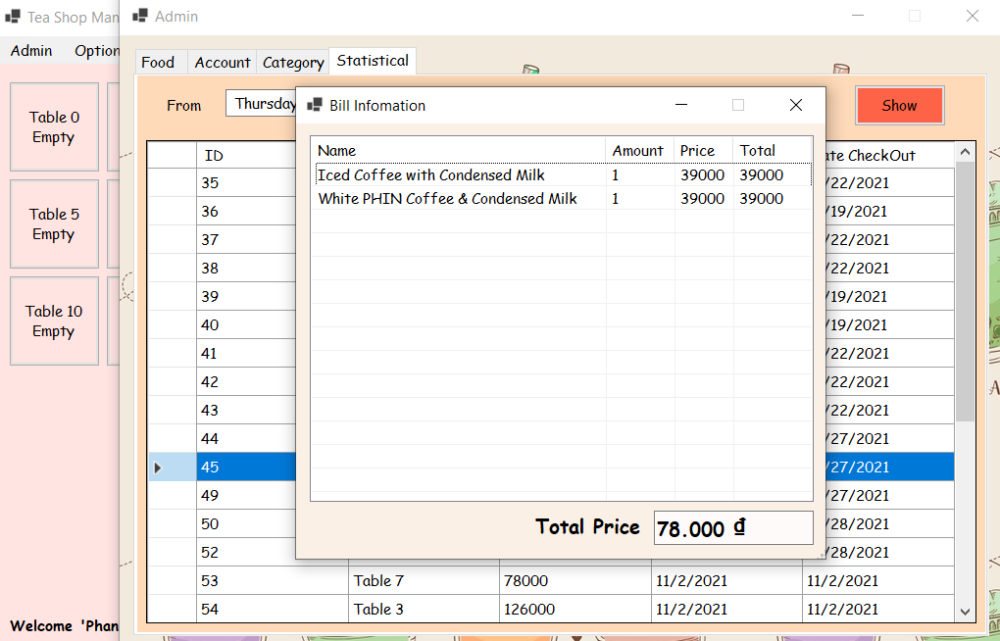

# Tea-Shop-Management
With society 4.0, the demand for trade also increases, especially with the higher demand for food and drink. In order to target young people who like to eat and drink snacks, tea shops have also sprung up a lot and the demand for software to manage the sales statistics of these items has also increased.

## Preview

-Login

-Main View

-Add Bill

-Check Out

-Admin Management (Staff can't see this tab)

